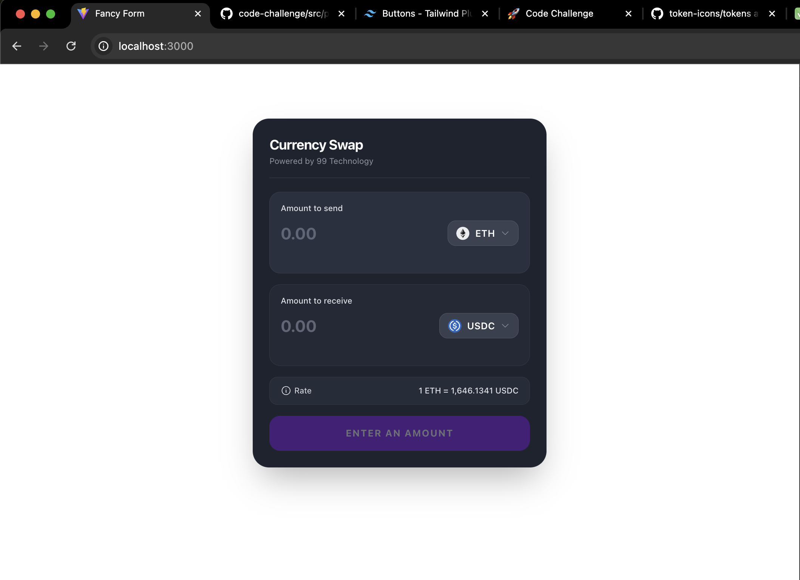
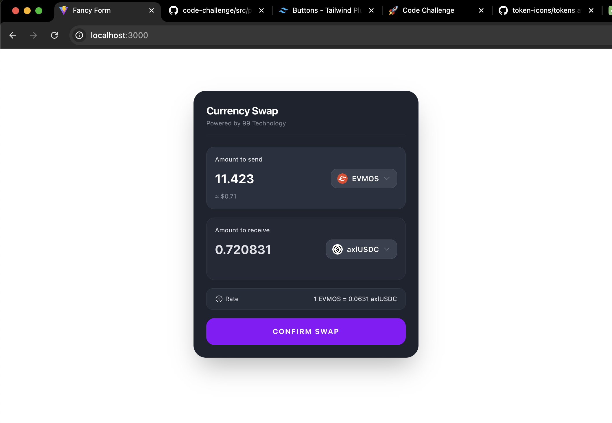
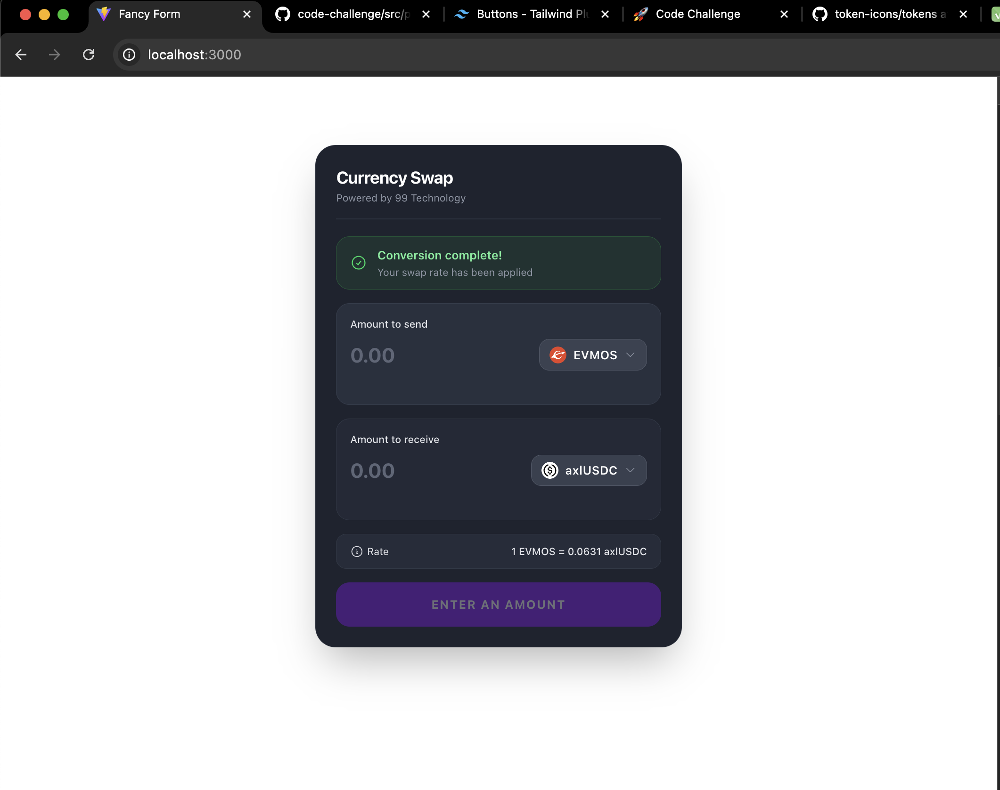
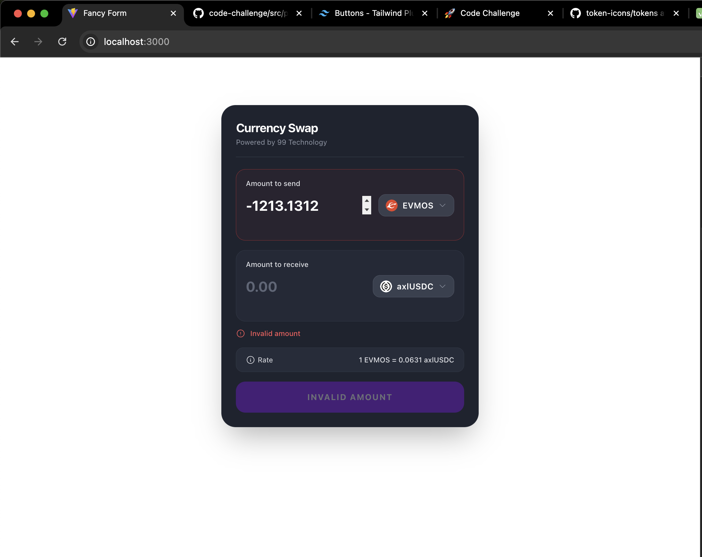
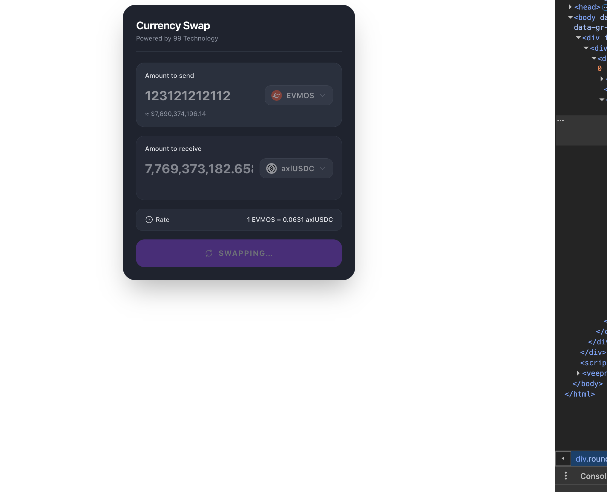

# Note for the reviewer

Dear 99 tech., this is my implementation for the challenges with some notes for the reviewer.

## Challenge #1

- I quickly setup typescript and go through the challenge with that.
- Bonus: There is a quick test flow, you can run it with `ts-node`: `npx ts-node --transpile-only src/problem1/problem1.test.ts`.

## Challenge #2

- Screenshots for the outcome:

- I use my top convention boilerplate for this: Vital: Vite with React, TypeScript & Tailwindcss. This one bootstraps almost all the latest tech I use in daily basis
- Dynamic conversion with price and token change flow. I break the components into atom, follow the SOLID principles.
- Project structure is well represent my convention for feature building: with interfaces via `@types`, common util/helper via `@util`, separate the UI at `@components` and `@hooks`...
- Mock the API flow with custom hooks representing the flow of `tanstack-query`.

## Challenge #3

- problem3.tsx is the original code for reviewing and refactoring
- problem3.codeReview.md is the list I found for the anti patterns and logical violation.
- problem3.refactored.tsx is the new refactoring outcome.

Happy reviewing!
